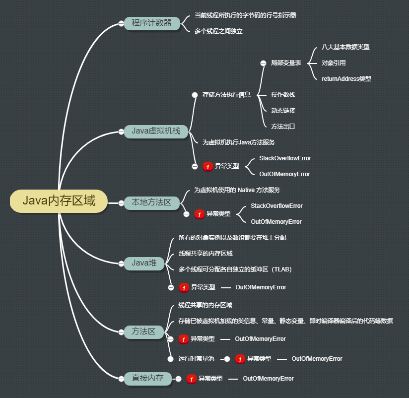

# Java内存区域

[TOC]

## 一、 运行时数据区域

根据《Java虚拟机规范》的规定，Java虚拟机所管理的内存将会包括以下几个运行时数据区域。

### 1. 程序计数器

是一块较小的内存空间，可以看做是当前线程所执行的字节码的行号指示器。工作时通过改变计数器的值来选取下一条需要执行的字节码指令，分支、循环、跳转、异常处理、线程恢复等基础功能需要依赖这个计数器来实现。

在任何一个确定的时刻，一个处理器内核都只会执行一条线程中的指令。因此，为了线程切换后能够恢复到正确的执行位置，每条线程都需要有一个独立的程序计数器，各条线程之间计数器互不影响，独立存储，我们称这类内存区域为”线程私有“的内存。

> 如果线程正在执行的是一个 Java 方法，这个计数器记录的是正在执行的虚拟机字节码指令的地址
>
> 如果线程正在执行的是 Native 方法，那这个计数器值则为空（ Undefined ）。

**此内存区域是唯一一个在Java虚拟机规范中没有规定任何 `OutOfMemoryError` 情况的区域**

### 1.2 Java虚拟机栈

线程私有，生命周期同线程相同。描述的是Java方法执行的内存模型：每个方法执行的同时都会创建一个栈帧（Stack Frame）用于存储局部变量表、操作数栈、动态链接、方法出口等信息。每一个方法从调用直至执行完成的过程，就对应着一个栈帧在虚拟机栈中入站到出站的过程

局部变量表存放了编辑器可知的基本数据类型（`boolean`、`char`、`int`、`short`、`float`、`long`、`double`、`byte`）、对象引用和 `returnAddress` 类型。

64位长度的 `long` 和 `double` 类型的数据会占用 2 个局部变量空间（Slot），其余的数据类型值占用 1 个。局部变量表所需的内存空间在编译期间完成分配，当进入一个方法时，这个方法需要在帧中分配多大的局部变量空间是完全确定的，在方法运行期间不会改变局部变量表的大小。

> 如果线程请求的帧深度大于虚拟机栈所允许的深度，将抛出 `StackOverflowError` 异常
>
> 如果虚拟机栈可以动态扩展，且扩展时无法申请到足够的内存，就会抛出 `OutOfMemoryError` 异常

### 1.3 本地方法栈

与虚拟机栈区别：虚拟机栈为虚拟机执行Java方法服务，而本地方法栈则为虚拟机使用的 Native 方法服务。

> 本地方法栈也会抛出 `StackOverflowError` 和 `OutOfMemoryError` 异常

### 1.4 Java堆

是被所有线程共享的一块内存区域，在虚拟机启动时创建。唯一目的就是存放对象实例。根据Java虚拟机规范说明：**所有的对象实例以及数组都要在堆上分配**。

Java堆是垃圾收集器管理的主要区域。

从内存会受到额角度看，基于收集器基本都采用**分代收集算法**，Java堆可以细分为：

1. 新生代Eden
2. From Survivor 空间
3. To Survivor 空间
4. Meta Space

从内存分配的角度来看，线程共享的Java堆可能划分出多个线程私有的分配缓冲区（Thread Local Allocation Buffer， TLAB）。

根据Java虚拟机规范的规定，Java堆可以处于物理上不连续的内存空间中，只要逻辑上是连续的即可，就像我们的磁盘空间一样。在实现时，既可以实现成固定大小的，也可以是可扩展的。

> 如果在堆中没有内存完成实例分配，且堆无法再扩展时，将会抛出 `OutOfMemoryError` 异常。

### 1.5 方法区

与Java堆一样，属于线程共享的内存区域，用于存储已被虚拟机加载（ClassLoader）的类信息、常量、静态变量、即时编译器编译后的代码、通过反射创建的对象（JIT）等数据。别名 `Non-Heap` （非堆）

这个区域内存回收的主要是针对常量池的回收和对类型的卸载。

> 当方法区无法满足内存分配需求时，将抛出 `OutOfMemoryError` 异常

### 1.6 运行时常量池（Runtime Constant Pool）

属于方法区的一部分。Class 文件中除了有类的版本、字段、方法、接口等描述信息外，还有一项信息是常量池，用于存放编译器生成的各种字面量和符号引用，这部分内容将在类加载后进入方法区的运行时常量池中存放。

运行时常量池相对于 Class 文件常量池的另外一个重要特征是具备动态性，Java语言并不要求常量一定只有编译期才能产生，也就是并非预置入 Class 文件中常量池的内容才能进入方法区运行时常量池，运行期间也可能将新的常量放入池中，利用较多的就是 `String` 类的 `intern()` 方法。

> 当常量池无法再申请到内存时就会抛出 `OutOfMemoryError` 异常

### 1.7 直接内存

并不是虚拟机运行时数据区的一部分，也不是Java虚拟机规范中定义的内存区域，但是这部分内存也被频繁的使用，而且也可能导致 `OutOfMemoryError` 异常出现。

JDK 1.4 之后新加入NIO类，引入基于通道（Channel）和缓冲区（Buffer）的 I/O 方式，它可以使用 Native 函数库直接分配对外内存，然后通过存储在Java堆中的 `DirectByteBuffer` 对象作为这块内存的引用进行操作。避免了数据拷贝，提升性能。

> 当配置的各个区域内存总和大于实际物理内存限制，在动态扩展时可能会发生 `OutOfMemoryError` 异常